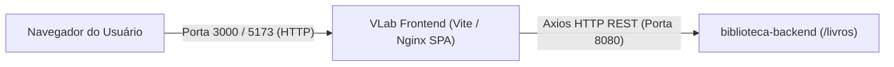

# Runbook Operacional: VLab - Biblioteca Virtual (Frontend) 💻⚙️

Este documento é o Manual Operacional (Runbook / SOP) da interface web SPA **VLab**. Ele orienta engenheiros de software, operadores e equipes de suporte na inicialização, validação de integridade, compilação de produção, deploy em containers e resolução de falhas.

---

## 1. Ficha Técnica e Arquitetura do Serviço

| Atributo | Detalhes |
| :--- | :--- |
| **Nome do Serviço** | `vlab-frontend` |
| **Tecnologias** | React 19, TypeScript, Vite 8, Axios, Vitest, Oxlint, Nginx Alpine |
| **Porta (Dev)** | `5173` (Vite dev server) |
| **Porta (Preview Local)** | `4173` (Vite preview) |
| **Porta (Produção Docker)** | `3000` (mapeada para a porta interna `80` do Nginx) |
| **Dependência Upstream** | API REST Backend (`biblioteca-backend`) na porta `8080` |
| **Artefato de Saída** | Diretório estático `dist/` |
| **Imagem Docker** | `vlab-frontend:latest` (base: `nginx:alpine`) |

### Fluxo de Comunicação


---

## 2. Variáveis de Ambiente & Configuração de Build

> [!CRITICAL]
> **Atenção sobre Vite em Produção:**  
> O Vite compila as variáveis prefixadas com `VITE_` **em tempo de build** (estáticas no bundle JS).  
> Portanto, alterar variáveis via `docker run -e` em tempo de execução **não** altera o código compilado. Para alterar a URL da API no Docker, deve-se usar `--build-arg VITE_API_URL=...` durante o `docker build`.

| Variável | Valor Padrão | Descrição |
| :--- | :--- | :--- |
| `VITE_API_URL` | `http://localhost:8080` | URL base da API REST do backend |

Para ambiente de desenvolvimento local, crie um arquivo `.env` na raiz de `vlab/`:
```env
VITE_API_URL=http://localhost:8080
```

---

## 3. Procedimentos Operacionais Padrão (SOP)

### SOP-01: Inicialização em Modo Desenvolvimento Local

```powershell
# 1. Navegar até o diretório do frontend
cd C:\Users\nando\GitHub\vlab

# 2. Instalar dependências (caso não estejam instaladas ou após atualizações)
npm install

# 3. Iniciar servidor Vite com Hot Module Replacement (HMR)
npm run dev
```
Acesse em: 👉 `http://localhost:5173`

---

### SOP-02: Execução de Testes e Validação de Qualidade

Antes de qualquer merge ou deploy, execute a suíte de verificação:

```powershell
# 1. Executar análise estática de código (Oxlint)
npm run lint

# 2. Executar suíte de testes unitários e de componentes (Vitest)
npm test
```

---

### SOP-03: Geração do Pacote de Produção (Build)

Compila os tipos TypeScript e minifica os ativos web:

```powershell
npm run build
```
- Os artefatos finais são gerados no diretório `dist/`.
- Caso haja qualquer erro de tipagem no TypeScript, o comando `tsc -b` interromperá a compilação antes de gerar o bundle.

---

### SOP-04: Teste de Pré-Produção Local (Preview)

Permite testar o comportamento do bundle compilado em `dist/` antes do deploy real:

```powershell
npm run preview
```
Acesse em: 👉 `http://localhost:4173`

---

### SOP-05: Execução Contínua em Servidor Local com PM2 + Serve

Para ambientes onde a SPA deve rodar como serviço em background no Windows/Linux sem Docker:

```powershell
# 1. Instalar utilitários globais
npm install -g serve pm2

# 2. Gerar o build otimizado
npm run build

# 3. Iniciar o serviço SPA escutando na porta 5173
pm2 serve dist 5173 --spa --name "vlab-frontend"

# 4. Comandos de monitoramento
pm2 status vlab-frontend          # Status de CPU/Memória
pm2 logs vlab-frontend            # Logs de requisições
pm2 restart vlab-frontend         # Reinicialização
pm2 stop vlab-frontend            # Parada do serviço
```

---

### SOP-06: Operação com Docker & Nginx

#### 1. Build da imagem com URL padrão da API (`http://localhost:8080`):
```bash
docker build -t vlab-frontend:latest .
```

#### 2. Build da imagem para ambiente com URL de API customizada:
```bash
docker build --build-arg VITE_API_URL=https://api.meudominio.com -t vlab-frontend:latest .
```

#### 3. Iniciar o container:
```bash
docker run -d \
  -p 3000:80 \
  --name vlab-frontend \
  --restart unless-stopped \
  --memory="256m" \
  vlab-frontend:latest
```
Acesse em: 👉 `http://localhost:3000`

---

### SOP-07: CI/CD com GitHub Actions e Docker Hub

O workflow `.github/workflows/ci.yml` valida frontend e backend em pull requests e pushes para `main`. Após um push aprovado ou disparo manual em `main`, publica as imagens `vlab` e `biblioteca-backend` no Docker Hub com tags `latest` e o SHA do commit. Em seguida, o job `deploy-local` faz pull dessas tags e atualiza a stack no runner local usando `compose.deploy.yml`.

#### Configuração no GitHub

Crie as credenciais como secrets no environment **lab**, em **Settings > Environments > lab**:

| Tipo | Nome | Valor |
| :--- | :--- | :--- |
| Secret | `DOCKERHUB_USERNAME` | Namespace/usuário Docker Hub em minúsculas |
| Secret | `DOCKERHUB_TOKEN` | Access token Docker Hub com permissão de leitura e escrita |
| Secret | `POSTGRES_PASSWORD` | Senha atual do banco; para o volume criado pelo Compose anterior, o valor atual é `postgres` |
| Secret | `JWT_SECRET` | Segredo JWT forte, com pelo menos 32 caracteres |

Crie no Docker Hub os repositórios `vlab` e `biblioteca-backend` no namespace configurado. O workflow também aceita `DOCKERHUB_USERNAME` como variable de repositório para compatibilidade. O backend é obtido da branch `main` do repositório público `especDevops/biblioteca-backend`.

#### Runner de deploy

Registre o runner self-hosted com o nome `DARTH` e atribua também o label `DARTH`, usado pelo workflow em `runs-on`. O nome do runner sozinho não é selecionável pelo GitHub Actions. Ele precisa permanecer ativo, ter Docker Engine/Desktop e Docker Compose v2 disponíveis no `PATH`, e o usuário do serviço do runner precisa poder acessar o daemon Docker. O runner é usado apenas no job de deploy; lint, testes, builds e publicação rodam em runners hospedados pelo GitHub.

O deploy publica a aplicação localmente em `http://localhost:5173`, a API em `http://localhost:8080` e mantém o volume de dados existente `github_biblioteca_db_data`. As portas são limitadas a loopback. Pull requests executam apenas validação; publicação e deploy só ocorrem em `main`.

#### Disparo manual do deploy

`workflow_dispatch` publica e implanta a revisão selecionada somente quando ela pertence a `main`. Para redeploy manual da última imagem no host, na pasta do checkout:

```powershell
$env:DOCKERHUB_USERNAME = "seu-usuario"
$env:IMAGE_TAG = "latest"
$env:POSTGRES_PASSWORD = "senha-atual-do-banco"
$env:JWT_SECRET = "seu-segredo-jwt"
docker compose -f compose.deploy.yml pull
docker compose -f compose.deploy.yml up -d --remove-orphans --wait --wait-timeout 180
```

Não armazene esses valores em arquivos commitados. O `POSTGRES_PASSWORD` deve corresponder à senha gravada no volume atual; alterar apenas a variável não troca a senha de um banco já inicializado.

---

## 4. Verificação de Integridade (Health Check & Smoke Test)

Execute as validações a seguir após iniciar a interface:

### 1. Teste de Resposta HTTP do Servidor Web
```powershell
# Validar se o servidor está respondendo com HTTP 200
(Invoke-WebRequest -Uri "http://localhost:5173" -UseBasicParsing).StatusCode
# (Ou porta 3000 se rodando em Docker)
```
*Resultado Esperado:* `200`

### 2. Validação de Conectividade com o Backend
1. Abra o navegador em `http://localhost:5173` (ou `3000`).
2. Abra o Console de Ferramentas do Desenvolvedor (`F12` -> aba *Console* e *Network*).
3. Verifique se a requisição `GET /livros` é disparada com sucesso (`HTTP 200`).
4. Caso a tela exiba mensagem de erro ou lista vazia por falha de rede, consulte a seção de incidentes abaixo.

---

## 5. Matriz de Resolução de Incidentes (Troubleshooting)

### Incidente 1: `Port 5173 (ou 3000) already in use`
- **Sintoma:** O Vite sobe em outra porta (ex: `5174`) ou o Docker acusa `port is already allocated`.
- **Ação de Diagnóstico:**
  ```powershell
  Get-NetTCPConnection -LocalPort 5173 -ErrorAction SilentlyContinue | Select-Object LocalAddress, LocalPort, OwningProcess
  ```
- **Ação Corretiva:**
  ```powershell
  Stop-Process -Id <PID> -Force
  ```
  No Docker:
  ```bash
  docker ps --filter "publish=3000"
  docker stop <CONTAINER_ID>
  ```

---

### Incidente 2: `AxiosError: Network Error` ou Erro de CORS no Navegador
- **Sintoma:** O frontend carrega, mas os livros não aparecem e o console do navegador exibe `ERR_CONNECTION_REFUSED` ou `Access-Control-Allow-Origin missing`.
- **Causas Possíveis & Soluções:**
  1. **Backend Offline:** Verifique se o backend está rodando em `http://localhost:8080`:
     ```powershell
     Test-NetConnection -ComputerName "localhost" -Port 8080
     ```
  2. **URL da API incorreta:** Verifique o valor de `VITE_API_URL` configurado. Se o container foi construído sem o `--build-arg` adequado, recompile a imagem.

---

### Incidente 3: Falha no comando `npm run build` (`TS2304` / Erro de compilação TypeScript)
- **Sintoma:** O build falha na etapa `tsc -b`.
- **Causa:** Inconsistência de tipos ou alterações de interface não compatíveis.
- **Ação de Diagnóstico:**
  ```powershell
  npx tsc -b --noEmit
  ```
- **Ação Corretiva:** Ajustar os arquivos TypeScript indicados ou verificar compatibilidade em `src/services/livroService.ts`.

---

### Incidente 4: Erro 404 ao recarregar a página em produção (Nginx)
- **Sintoma:** Acessar a raiz funciona, mas ao atualizar uma rota interna diretamente a página exibe `404 Not Found`.
- **Causa:** O servidor web não está redirecionando rotas inexistentes para `index.html`.
- **Validação:** Garanta que o arquivo `nginx.conf` possua a diretiva SPA:
  ```nginx
  location / {
      try_files $uri $uri/ /index.html;
  }
  ```

---

### Incidente 5: Cache local do Vite corrompido ou desatualizado
- **Sintoma:** Alterações em componentes ou dependências não têm efeito no navegador durante `npm run dev`.
- **Ação Corretiva:**
  ```powershell
  # Limpar o cache de compilação do Vite e dependências
  Remove-Item -Recurse -Force node_modules\.vite -ErrorAction SilentlyContinue
  Remove-Item -Recurse -Force dist -ErrorAction SilentlyContinue
  npm run dev -- --force
  ```

---

## 6. Procedimento de Parada e Rollback de Emergência

### Parada Imediata do Processo Local:
```powershell
# Encerrar processos Node do usuário
Get-Process -Name "node" | Stop-Process -Force
```

### Parada do Container Docker:
```bash
docker stop vlab-frontend
docker rm vlab-frontend
```

### Rollback de Versão em Produção:
1. Reverter para a tag anterior homologada:
   ```bash
   docker run -d -p 3000:80 --name vlab-frontend vlab-frontend:v1.0.0
   ```
2. Caso use hospedagem estática (S3/Vercel/Netlify), realize o rollback instantâneo pelo painel de controle ou redeploy do commit estável anterior.
